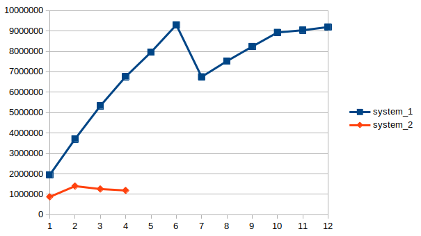

Gianni Monteban & Martijn Vogelaar\
S1047546 & S1047391
# Assignment-5 Benchmark Mandelbrot

We have chosen to use the Tier 1 solution. We removed all the code for the Tier 2 and 3 solution from the mandelbrot.

We used the performance analyzing tool **perf**. With this tool we can calculate the number of FLOP operations. This tool also returns the execution time of the program.

## Systems

We've benchmarked the program on the following two different systems:
* **System 1**:  Ryzen 5 3600, Nvidia RTX 3060Ti
* **System 2**:  i5 6200U, HD Graphics 520

## Benchmark

Using the perf tool and the following command: "perft list" we retrieved a list of hardware pmu events, we chose the event which included all Floating point operations. For the first system this was the event: 
* System 1: **fp_ret_sse_avx_ops.all**, description: [All FLOPS]
* System 2: **fp_arith_inst_retired.scalar_double** description: [Number of SSE/AVX computational scalar double precision floating-point instructions retired. Each count represents 1 computation. Applies to SSE* and AVX* scalar double precision
        floating-point instructions: ADD SUB MUL DIV MIN MAX SQRT FM(N)ADD/SUB. FM(N)ADD/SUB instructions count twice as they perform multiple calculations per element]

**System 1** performance:

    Single core: 382.359.951 FLOP in  196.0 seconds
    Multi core(2): 382.152.573 FLOP in 103.2 seconds
    Multi core(3): 382.205.087 FLOP in 71.7 seconds
    Multi core(4): 382.140.085 FLOP in 56.5 seconds
    Multi core(5): 382.140.156 FLOP in 48.0 seconds
    Multi core(6): 382.100.096 FLOP in 41.1 seconds
    Multi core(7): 382.135.896 FLOP in 56.6 seconds
    Multi core(8): 382.106.813 FLOP in 50.8 seconds
    Multi core(9): 382.150.112 FLOP in 46.4 seconds
    Multi core(10): 382.109.545 FLOP in 42.8 seconds
    Multi core(11): 382.249.085 FLOP in 42.3 seconds
    Multi core(12): 382.442.300 FLOP in 41.6 seconds

**System 2** performance:

    Single core: 382.100.093 FLOP in 437.7 seconds
    Multi core(2): 382.100.093 FLOP in 273.2 seconds
    Multi core(3): 382.100.093 FLOP in 304.2 seconds
    Multi core(4): 382.100.093 FLOP in 322.5 seconds

In the graph we can see a drop after half of the number of threads are in use. We expect that this comes due to the fact that our machines only have 2 or 6 cores but the double (4 and 12) number of threads. 

## Problems during the assignment

### Multi processing

After adding the -t mt_pth command line option we got an error stating that too many files were input. We only managed to use the -t mt_pth command line option if we removed the -check tc command line option.

### CUDA

We tried doing the benchmark using the command line option -t CUDA. We did not manage to compile the program using it. We installed CUDA from the Nvidia website, ran the CUDA test from Nvidia which worked fine. We then tried to install the CUDA repo from SaC but got the following error:

    abort: Configuration files do not contain specification of target 'cuda`

